## **UNITY 2022 LTS EDITION** ⟶ E-BOOK


Introduction to the Data-Oriented Technology Stack for advanced Unity developers

# **Contents**

| Introduction 4                         |
|----------------------------------------|
| About performance 5                    |
| DOTS and the Entity Component System 9 |
| The C# job system 9                    |
| Scheduling and completing jobs 11      |
| Job safety checks and dependencies 11  |
| The Burst compiler 12                  |
| Collections 14                         |
| Mathematics 15                         |
| Entities (ECS) 15                      |
| Archetypes 16                          |
| Chunks 17                              |
| Queries 18                             |
| Job system integration 19              |
| Subscenes and baking 20                |
| Streaming 22                           |
| EntityComponentSystemSamples Github 22 |
| Entities Graphics 25                   |
| Physics 26                             |
| Netcode for Entities 26                |
| Authoritative server 26                |
| Client-side prediction 27              |
| Character Controller 28                |
| What's on the DOTS roadmap? 29         |

| Evaluating DOTS for your project 30                     |
|---------------------------------------------------------|
| Made with DOTS 31                                       |
| Made with DOTS: Bare Butt Boxing, by Tuatara Games. 32  |
| Made with DOTS: Histera, by StickyLock Games 33         |
| Made with DOTS: V Rising, by Stunlock Studios 34        |
| Made with DOTS: Zenith: The Last City, by Ramen VR . 35 |
| Made with DOTS: Megacity Metro sample 36                |
|                                                         |
| Appendix: Concepts<br>related to ECS 37                 |
| Memory allocation and garbage collection 37             |
| Multithreaded programming 39                            |
| Memory and CPU cache 40                                 |
| Costs of object-oriented programming 42                 |

# <span id="page-3-0"></span>Introduction

This guide explains the potential performance benefits of Unity's Data-Oriented Technology Stack (DOTS). It provides a high-level overview of each of the packages and features included in the stack, as well as explaining some of the core concepts related to, and impacted by, design-oriented design (DOD). It doesn't go into the details of the API's, but you will find links throughout to many new DOTS tutorials and other learning resources where you can learn more.

Our goal with the e-book is to provide you with the knowledge you need to make an informed decision about whether your Unity project will benefit from using some or all of the DOTS features.

#### **Author and expert contributors**

This e-book was created from a collaboration between Unity DOTS engineers and external experts. The main author is Brian Will, a senior software engineer at Unity. Other experts who contributed to this guide are:

- Nik Lever, real-time 3D and Unity educator
- Steve McGreal, software engineer
- Daniel Kierkegaard Andersen, software engineer, Unity
- Laurent Gibert, director, product management, Unity

# <span id="page-4-0"></span>About performance

If you're an experienced game developer then you know that performance optimization on target platforms is a task [that runs through](https://unity.com/resources/ultimate-guide-to-profiling-unity-games?isGated=false) the entire development cycle. Maybe your game performs nicely on a high-end PC, but what about the low-end mobile platforms you're also aiming for? Do the frames take much longer than others, creating noticeable hitches? Are loading times annoyingly long, and does the game freeze for full seconds every time the player walks through a door? In such a scenario, not only is the current experience subpar, but you're effectively blocked from adding more features: more environment detail and scale, mechanics, characters and behaviors, physics, and platforms.

What's the culprit? In many projects it's rendering: textures are too large, meshes too complex, shaders too expensive, or there's ineffective use of batching, culling, and LOD.

Another common pitfall is excessive use of complex mesh colliders, which greatly increase the cost of the physics simulation. Or, the game simulation itself is slow. The C# code you wrote that defines what makes your game unique – that might be taking too many milliseconds of CPU time per frame.

So how do you write game code that is fast, or at least not slow?

In previous decades, PC game developers could often solve this problem by just waiting. From the 1970's and into the 21st century, CPU single-threaded performance generally doubled every few years (a phenomenon known as [Moore's law\)](https://en.wikipedia.org/wiki/Moore%27s_law), so a PC game would "magically" get faster over its life cycle. In the last two decades, however, CPU single-threaded performance gains have been relatively modest. Instead, the number of cores in the CPU have been growing and even small handheld devices like smartphones today feature several cores. Moreover, the gap between high-end and low-end gaming devices has widened, with a large chunk of the player base using hardware that is several years old. Waiting for faster hardware no longer seems like a workable strategy.


The question to ask, then, is "Why is my CPU code slow in the first place?" There are several common pitfalls:

- **Garbage collection induces noticeable overhead and pauses:** This occurs because the [garbage collector](https://learn.microsoft.com/en-us/dotnet/standard/garbage-collection/fundamentals) serves as an automatic memory manager that manages the allocation and release of memory for an application. Not only does garbage collection incur CPU and memory overhead, it sometimes pauses all execution of your code for many milliseconds. Users might experience these pauses as small hitches or more intrusive stutters.
- **The compiler-generated machine code is suboptimal:** Some compilers generate much less optimized code than others, with results varying across platforms.
- **The CPU cores are insufficiently utilized:** Although today's lowest-end devices have multi-core CPUs, many games simply keep most of their logic on the main thread because writing multithreaded code is often difficult and prone to error.
- **The data is not cache friendly:** Accessing data from cache is much faster than fetching it from main memory. However, accessing system memory may require the CPU to sit and wait for hundreds of CPU cycles; instead, you want the CPU to read and write data from its cache as much as possible.

The simplest way to arrange this is to read and write memory sequentially, and so the most cache-friendly way to store data is in tightly-packed, contiguous arrays. Conversely, if your data is strewn non-contiguously throughout memory, accessing it will typically trigger many expensive cache misses; the CPU requests data that is not present in the cache memory and instead needs to fetch it from the slower main memory

- **The code is not cache friendly:** When code is executed, it must be loaded from system memory if it's not already sitting in cache. One strategy is to favor calling a function in as few places as possible to reduce how often it must be loaded from system memory. For example, rather than call a particular function at various places strewn throughout your frame, it's better to call it in a single loop so that the code only needs to be loaded at most once per frame.
- **The code is excessively abstracted:** Among other issues, abstraction tends to create complexity in both data and code, which exacerbates the aforementioned problems: managing allocations without garbage collection becomes harder; the compiler may not be able to optimize as effectively; safe and efficient multithreading becomes harder, and your data and code tend to become less cache-friendly. On top of all this, abstractions tend to spread around performance costs, such that the whole code is slower, leaving you with no clear bottlenecks to optimize.


All of the above ailments are commonly found in Unity projects. Let's look at these more specifically:

- *—* Although C# allows you to create manually-allocated objects (meaning objects which are not garbage collected), the default norm in C# and most Unity projects is to use **C# class instances**, which are garbage collected. In practice, Unity users have long mitigated this issue with a technique called [pooling](https://unity.com/how-to/use-object-pooling-boost-performance-c-scripts-unity) (even though pooling arguably defeats the purpose of using a garbage-collected language in the first place). The main benefit of object pooling is the efficient reuse of objects from a preallocated pool, eliminating the need for frequent creation and deallocation of objects.
- In the Unity Editor, C# code is normally compiled to machine code with the **Mono Compiler.** For standalone builds you can generally get better results using [IL2CPP](https://docs.unity3d.com/Manual/IL2CPP.html) (C# Intermediate Language cross-compiled to C++), but this brings some downsides, like longer build times and making [mod support](https://en.wikipedia.org/wiki/Video_game_modding) more difficult.
- *—* It's common that Unity projects **run all their code on the main thread**, partly because doing so is what Unity makes easy:
	- *—* The Unity event functions, such as the Update() method of MonoBehaviours, are all run on the main thread.
	- *—* Most Unity APIs can only be safely called from the main thread.
- *—* The data in a typical Unity project tends to be structured as **a bunch of random objects scattered throughout memory**, leading to very poor cache utilization. Again, this is partly because it's what Unity makes easy:
	- *—* A GameObject and its components are all separately allocated, so they often end up in different parts of memory.
- *—* The **code in a typical Unity project tends to not be cache friendly**:
	- *—* Conventional C# and Unity's APIs encourage an object-oriented style of code, which tends towards numerous small methods and complex call chains. Unlike a data-oriented approach it's not very hardware friendly.
	- *—* The event functions of every MonoBehaviour are invoked individually, and the calls are not necessarily grouped by MonoBehaviour type. For example, if you have 1000 **Monster** MonoBehaviours, each Monster is updated separately and not necessarily along with the other Monsters.
- *—* The object-oriented style of conventional C# and many Unity APIs generally lead to **abstraction-heavy solutions**. The resulting code then tends to have inefficiencies laced throughout that are hard to disentangle and isolate.


For more background information on these issues, see the appendix at the end of this guide that covers the following concepts:

- *—* [Memory allocation and garbage collection](#page-36-0)
- *—* [Multithreaded programming](#page-38-0)
- *—* [Memory and CPU cache](#page-39-0)
- *—* [Object-oriented programming and abstraction](#page-41-0)
- *—* [Data-oriented design](#page-44-0)

# <span id="page-8-0"></span>DOTS and the Entity Component System

Unity's [Entity Component System](https://docs.unity3d.com/Packages/com.unity.entities@1.1/manual/index.html) (ECS) is the data-oriented architecture that underpins DOTS packages and technologies. ECS delivers a high level of control and determinism over data in memory and runtime process scheduling in Unity.

ECS for Unity 2022 LTS comes with two compatible physics engines, a high-level Netcode package, and a rendering framework to render large amounts of ECS data to Unity's Scriptable Render Pipelines (SRP), including the Universal Render Pipeline (URP) and the High Definition Render Pipeline (HDRP). It's compatible with GameObject data, allowing you to leverage systems that as of Unity 2022 LTS, do not natively support ECS, such as animation, navigation, input, or terrain.

This section focuses on the features of DOTS and how they facilitate writing code that avoids the CPU performance pitfalls outlined in the prior section.

The best starting place for learning about the specific DOTS packages is the [EntityComponentSystemSamples](https://github.com/Unity-Technologies/EntityComponentSystemSamples/tree/master) Github, which includes explanatory reading and videos, along with many samples.

However, before you dive into the samples, let's look at the features and packages that make stack.

# The C# job system

The [C# job system](https://docs.unity3d.com/Manual/JobSystemOverview.html) provides an easy and efficient way to write multithreaded code that helps your application take advantage of all available CPU cores.

Unlike the other features of DOTS, the job system is not a package but rather is included in the Unity core module.


| CPU Usage<br>· VSync<br>Others<br>Rendering<br>Scripts<br>Physics | 66ms (15FPS)<br>33ms (30FPS) |                                                                                                                                                                                |                                                                                                   |      |                   |                                            |
|-------------------------------------------------------------------|------------------------------|--------------------------------------------------------------------------------------------------------------------------------------------------------------------------------|---------------------------------------------------------------------------------------------------|------|-------------------|--------------------------------------------|
| Animation<br>GarbageCollector<br>Global Illumination<br>UI        | 16ms (60FPS)                 | 0.64ms<br>0.02ms                                                                                                                                                               | 0.00ms<br>21.31ms<br>0.00ms  0.00ms                                                               |      |                   |                                            |
| Timeline                                                          | Live                         |                                                                                                                                                                                | 0.01ms   0.00ms<br>CPU:24.43ms GPU :-- ms                                                         |      |                   |                                            |
|                                                                   | Oms                          | 5ms                                                                                                                                                                            | 10ms                                                                                              | 15ms | 20ms              |                                            |
| Main Thread                                                       |                              |                                                                                                                                                                                | PlayerLoop (20.97ms)                                                                              |      |                   | (0)rLoop (1.4                              |
|                                                                   |                              |                                                                                                                                                                                | SimulationSystemGroup (19.16ms)                                                                   |      | ystemG            | DoRender                                   |
|                                                                   |                              |                                                                                                                                                                                | UpdateFunction.Invoke() (19.16ms)<br>Default World Unity.Entities.SimulationSystemGroup (19.16ms) |      | on.invo<br>Presen | IRenderTo<br>ameraSta                      |
|                                                                   | ixedStepSimu                 |                                                                                                                                                                                | Default World Unity. EndSimulation EntityCommandBufferSystem (17.06ms)                            |      | Q.Hv              |                                            |
|                                                                   |                              |                                                                                                                                                                                | JobHandle.Complete (15.85ms)                                                                      |      | plourings         |                                            |
|                                                                   |                              |                                                                                                                                                                                | WaitForJobGroupID (15.85ms)                                                                       |      | Buffer.Pl         |                                            |
|                                                                   |                              | tem:Viscosity (Bu ) prs:PopulateNeighbours   gSystem:SpringAdjustment (Burst) (5.2) :DensityCatem:Density                                                                      |                                                                                                   |      |                   |                                            |
|                                                                   |                              |                                                                                                                                                                                | ><br>Gfx.WaitForGfxCommandsFromMainThread (19.46ms)                                               |      |                   |                                            |
| Render Thread                                                     |                              |                                                                                                                                                                                |                                                                                                   |      | ndsFro            | iderSingleCa<br>alRenderPipe<br>queObjects |
| Job                                                               |                              |                                                                                                                                                                                |                                                                                                   |      |                   |                                            |
| Worker 0                                                          |                              | earLeafNodesJob (Buem:Viscosity (Bully:s:PopulateNeighbours (System:SpringAdeminent (Burst) (5.2):DensityCatem:Density     le (1.28m                                           |                                                                                                   |      |                   | le (1.11m<br>fle (1.40ms                   |
| Worker 1                                                          |                              | learLeafNodesJob (Buen:Viscosity (Buyors:PopulateNeighbours () gSystem:SpringAtem:Density   [e.(1/25ml                                                                         |                                                                                                   |      |                   | le (1.16m<br>dle (1.60ms)                  |
| Worker 2                                                          |                              | NearLeaNodesJob (Burm:Viscosity (1) ors:PopulateNeighbours (gSystem:SpringAtiont(Burst) (5.2):DensityCatem:Density - le (1.28m                                                 |                                                                                                   |      |                   | die (1.66ms)<br>le (1.16m                  |
| Worker 3                                                          |                              | earLeafNodesJob (Blem:Viscosity (Burors:PopulateNeighbours (gSystem:SpringAdminnent (Burst) (1.2 (1.28m) (                                                                     |                                                                                                   |      |                   | Je (1.15m<br>Idle (1.61ms)                 |
| Worker 4                                                          |                              | JearLeafNodesJob (BuentViscosity (Bu prs:PopulateNeighbours) gSystem:SpringAjimIment (Burst) (5.3):DensityCtlem:Density     0 (1.28m                                           |                                                                                                   |      |                   | le (1.12m<br>Ille (1.32ms                  |
| Worker 5                                                          |                              | learLeafNodesJob (Btem:Viscosty (Bully: cs:PopulateNeighbourg cSystem:SpringAdminent (Burst) (5.2):DensityCatem:Density     0 (1.27m                                           |                                                                                                   |      |                   | le (1.16m<br>Idle (1.67ms)                 |
| Worker 6                                                          |                              | earLeafNodesJob (Buen:Viscosity (Buyors:PopulateNeighbours (gSystem:SpringAjtment (Burst) (5.2) :DensityCatem:Density       (1.27m                                             |                                                                                                   |      |                   | Ille (1.32ms<br>le (1.16m                  |
| Worker 7                                                          |                              | earLeafNodesJob (Buent:Viscosly (Bulors:PopulateNeighbours   gSystem:SpringAlem:Density   1.2 :Density       (1.27m)                                                           |                                                                                                   |      |                   | le (1.13m<br>ldle (1.66ms)                 |
| Worker 8                                                          |                              | earLeafNodesJob  Buem:Viscosty (Bu   gSystem:SpringAdminnent (Burst) (5.2) :DensityCatem:Density       (1.27m                                                                  |                                                                                                   |      |                   | le (1.16m<br>lidle (1.65ms)                |
| Worker 9                                                          |                              | earLeafNodesJob (Btem:Viscosity (Bu prs:PopulateNeighbours gSystem:SpringAtem:DensityCatem:Density     le (1.28m                                                               |                                                                                                   |      |                   | Je (1.16m)<br>Idle (1.66ms)                |
| Worker 10                                                         |                              | earLeafNodesJob (Buent:Viscosity (Bu - rs:PopulateNeighbours) gSystem:SpringAdminent (Burst) (5.2 ):DensityCatem:Density       e (1.28m)                                       |                                                                                                   |      |                   | le (1.16m<br>Idle (1.66ms)                 |
| Worker 11                                                         |                              | learLeafNodesJob (Bulors:PopulateNeighbours () gSystem:SpringAdimiment (Burst) (5.1) (DensityCatem:Density     (1.28m                                                          |                                                                                                   |      |                   | le (1.18m<br>Idle (1.66ms)                 |
| Worker 12                                                         |                              | ear Leat Nodes Job (Blem: Viscosity (Bu prs:PopulateNeighbours) (S.2): DensityCatem: Density Catem: Density Clem: Density Clem: Density Clem: Density Clem: Density Clem: Dens |                                                                                                   |      |                   | le (1.16m<br>Idle (1.68ms)                 |
| Worker 13                                                         |                              | earLeafNodesJob  Blem:Viscosty (Bur bros)   System:SpringAment (Burst) (5.2   :DensityCttem:Density   [ 0 (1.27m                                                               |                                                                                                   |      |                   | le (1.16m<br>      lle (1.31ms             |
| Worker 14                                                         |                              | lear Leaf Nodes Job (Buen Viscostly (Burn) SpringAde thent (Burs) (5.2) (Density Catem Density   1/0 (1.27m)                                                                   |                                                                                                   |      |                   | le (1.13m<br>Idle (1.68ms)                 |

A profile showing Burst-compiled jobs utilizing the potential of the CPU and running across many worker threads.

Because MonoBehaviour updates are executed only on the main thread, many Unity games end up running all of their game logic on just one CPU core. To take advantage of additional cores, you could manually spawn and manage additional threads, but doing so safely and efficiently can be very difficult.

For an easier alternative, Unity provides the C# job system:

- The job system maintains a pool of worker threads, one for each additional core of the target platform. For example, when Unity runs on eight cores, it creates one main thread and seven worker threads.
- The worker threads execute units of work called jobs. When a worker thread is idle, it pulls the next available job from the job queue to execute.
- Once a job starts execution on a worker thread, it runs to completion (in other words, jobs are not preempted).

<span id="page-10-0"></span>

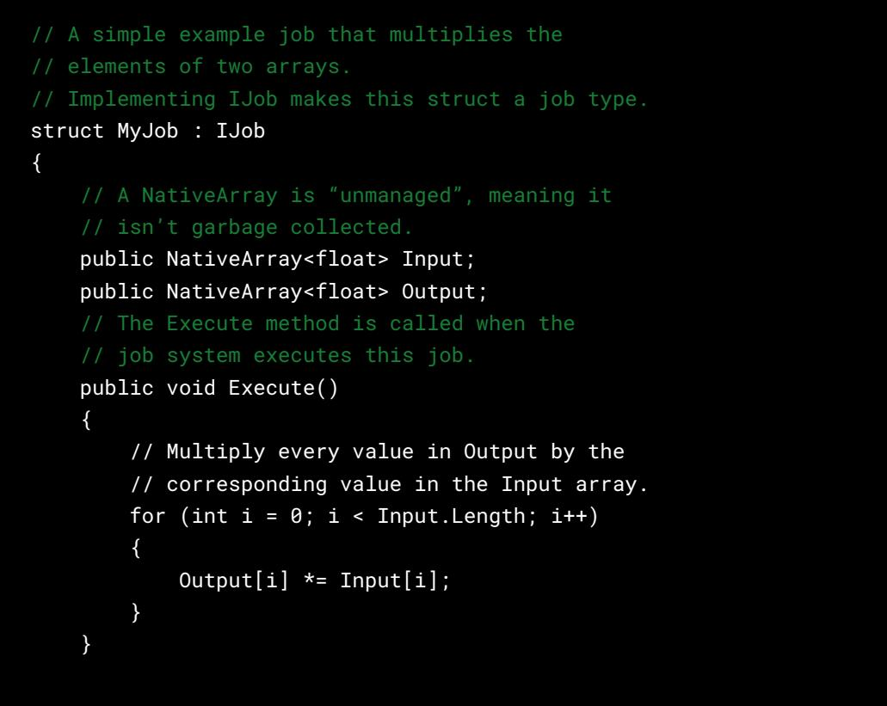

### **Scheduling and completing jobs**

- Jobs can only be scheduled (meaning, added to the job queue) from the main thread, not from other jobs.
- When the main thread calls the Complete() method on a scheduled job, it waits for the job to finish execution (if it hasn't finished already).
- Only the main thread can call Complete().
- After Complete() returns, you can be sure that the data used by the job is once again safe to access on the main thread and safe to be passed into subsequently scheduled jobs.

#### **Job safety checks and dependencies**

In multithreaded programming, ensuring safety and managing dependencies between threads are critical for avoiding race conditions, data corruption, and other concurrency issues. It's beyond the scope of this guide to explain these pitfalls. The key takeaway is to understand how the job system handles safety checks and dependencies:

— For guaranteed isolation, each job has its own private data that the main thread and other jobs can't access.

<span id="page-11-0"></span>

- However, jobs may also need to share data with each other or the main thread. Jobs that share the same data should not execute concurrently because this creates race conditions. So the job system "safety checks" throw errors when you schedule jobs that might conflict with others.
- When scheduling a job, you can declare that it depends upon prior scheduled jobs. The worker threads will not start executing a job until all of its dependencies have finished execution, allowing you to safely schedule jobs that would otherwise conflict.
	- For example, if jobs A and B both access the same array, you could make job B depend upon job A. This ensures job B will not execute until job A has finished, thus avoiding any possible conflict.
- Completing a job also completes all of the jobs it depends upon, directly and indirectly.

Many Unity features internally use the job system, so you will see more than just your own scheduled jobs running on the worker threads in the Profiler.

Note that jobs are intended only for processing data in memory, not performing I/O (input and output) operations, such as reading and writing files or sending and receiving data over a network connection. Because some I/O operations may block the calling thread, performing them in a job would defeat the goal of trying to maximize utilization of the CPU cores. If you want to do multithreaded I/O work, you should call asynchronous APIs from the main thread or use conventional C# multithreading.

To learn about jobs, start with the [jobs tutorial](https://github.com/Unity-Technologies/EntityComponentSystemSamples/tree/master/EntitiesSamples/Assets/Tutorials/Jobs) in the samples repo (there is also a [version on](https://learn.unity.com/tutorial/65b3de6bedbc2a59a499d5b9?uv=2022.3&projectId=65b3d3cfedbc2a5399ce3740#)  [Unity Learn\)](https://learn.unity.com/tutorial/65b3de6bedbc2a59a499d5b9?uv=2022.3&projectId=65b3d3cfedbc2a5399ce3740#).

## The Burst compiler

As stated earlier, C# code in Unity is by default compiled with [Mono,](https://docs.unity3d.com/Manual/Mono.html) a [JIT \(just-in-time\)](https://en.wikipedia.org/wiki/Just-in-time_compilation) compiler or, alternatively with [IL2CPP,](https://docs.unity3d.com/Manual/IL2CPP.html) an [AOT](https://en.wikipedia.org/wiki/Ahead-of-time_compilation) (ahead of time) compiler which generally gives better runtime performance and may be better supported on some target platforms.

The [Burst package](https://docs.unity3d.com/Packages/com.unity.burst@latest) provides a third compiler that performs substantial optimizations, often yielding dramatically better performance than Mono or even IL2CPP. Using Burst can greatly improve the performance and scalability of a heavy computation problem, as the following images illustrate:


| PlayerLoop (346.97ms)                                                                                                      |                                          |  |  |  |  |  |  |  |  |  |
|----------------------------------------------------------------------------------------------------------------------------|------------------------------------------|--|--|--|--|--|--|--|--|--|
| Update. ScriptRunBehaviourUpdate (346.44ms)                                                                                |                                          |  |  |  |  |  |  |  |  |  |
| BehaviourUpdate (346.44ms)                                                                                                 |                                          |  |  |  |  |  |  |  |  |  |
| FindNearest.Update() [Invoke] (0.33ms)<br>FindNearest.Update() [Invoke] (0.33ms)<br>FindNearest.Update() [Invoke] (0.33ms) |                                          |  |  |  |  |  |  |  |  |  |
|                                                                                                                            | FindNearest.Update() [Invoke]<br>0.334ms |  |  |  |  |  |  |  |  |  |
| Gfx.WaitForGfxC                                                                                                            |                                          |  |  |  |  |  |  |  |  |  |
| Semap  Current frame accumulated time:<br>342.92ms for 1000 instances on thread 'Main Thread'                              |                                          |  |  |  |  |  |  |  |  |  |
|                                                                                                                            | Copy Show ▼                              |  |  |  |  |  |  |  |  |  |
|                                                                                                                            | Idle (346.24ms)                          |  |  |  |  |  |  |  |  |  |
|                                                                                                                            |                                          |  |  |  |  |  |  |  |  |  |
|                                                                                                                            | Edito<br>PlayerLoop (4.91ms)             |  |  |  |  |  |  |  |  |  |
| Update. ScriptRunBehaviourUpdate (4.46ms)                                                                                  | date Al                                  |  |  |  |  |  |  |  |  |  |
| BehaviourUpdate (4.46ms)                                                                                                   | undın                                    |  |  |  |  |  |  |  |  |  |
| FindNearest.Update() [Invoke] (2.00ms)                                                                                     |                                          |  |  |  |  |  |  |  |  |  |
| JobHandle.Complete (1.41ms)                                                                                                |                                          |  |  |  |  |  |  |  |  |  |
| WaitForJobGroupID (1.41ms)                                                                                                 | Seeker.Update() [Invoke]                 |  |  |  |  |  |  |  |  |  |
|                                                                                                                            | 0.001ms                                  |  |  |  |  |  |  |  |  |  |
| FindNearestJob (Burst) (1.41ms)                                                                                            |                                          |  |  |  |  |  |  |  |  |  |
|                                                                                                                            | Current frame accumulated time:          |  |  |  |  |  |  |  |  |  |
| 0.767ms for 1000 instances on thread 'Main Thread'                                                                         |                                          |  |  |  |  |  |  |  |  |  |
|                                                                                                                            |                                          |  |  |  |  |  |  |  |  |  |
| 1                                                                                                                          | Show ▼<br>Copy                           |  |  |  |  |  |  |  |  |  |
| Gfx.WaitForGfxCommandsFromMainThread (4.52ms)                                                                              | 11451 1 V                                |  |  |  |  |  |  |  |  |  |
| Semaphore. WaitForSignal (4.52ms)<br>aitForS                                                                               |                                          |  |  |  |  |  |  |  |  |  |
|                                                                                                                            |                                          |  |  |  |  |  |  |  |  |  |
| D                                                                                                                          |                                          |  |  |  |  |  |  |  |  |  |

Top image: From the [jobs tutorial,](https://github.com/Unity-Technologies/EntityComponentSystemSamples/tree/master/EntitiesSamples/Assets/Tutorials/Jobs) the FindNearest updates, compiled with Mono, take 342.9 ms. Bottom image: From the same jobs tutorial, the FindNearestJob, compiled with Burst, takes 1.4 ms.

Understand, however, that Burst can only compile a subset of C#, so a lot of typical C# code can't be compiled with it. The main limitation is that Burst-compiled code can't access managed objects, including all class instances. As this excludes most conventional C# code, Burst compilation is only applied selectively to designated parts of code, such as jobs:

```
// The BurstCompile attribute marks this job to be Burst-compiled.
[BurstCompile]
struct MyJob : IJob
{
 public NativeArray<float> Input;
 public NativeArray<float> Output;
 public void Execute()
 {
 for (int i = 0; i < Input.Length; i++)
 {
 Output[i] *= Input[i];
 }
 }
}
```
<span id="page-13-0"></span>As described in [this video](https://youtu.be/WnJV6J-taIM?t=432), the performance gains of Burst come from the use of [SIMD](https://en.wikipedia.org/wiki/Single_instruction,_multiple_data) (a technique used to perform the same operation on multiple data elements simultaneously) and better awareness of [aliasing](https://en.wikipedia.org/wiki/Aliasing_(computing)) (when two or more pointers or references refer to the same memory location), among other techniques.

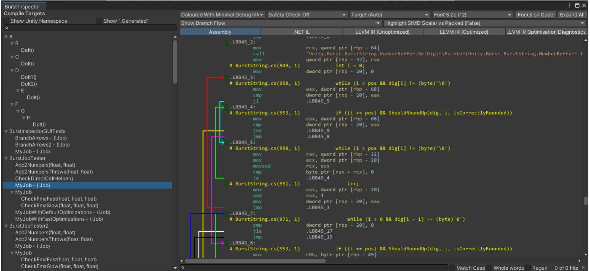

For expert users, Burst provides a few advanced features, such as [intrinsics](https://docs.unity3d.com/Packages/com.unity.burst@1.8/manual/csharp-burst-intrinsics.html) and the [Burst Inspector](https://docs.unity3d.com/Packages/com.unity.burst@1.8/manual/editor-burst-inspector.html) (pictured above), which shows the generated assembly code.

## Collections

The [Collections](https://docs.unity3d.com/Packages/com.unity.collections@2.4/manual/index.html) package provides unmanaged collection types, such as lists and hash maps which are optimized for usage in jobs and Burst-compiled code.

By "unmanaged", it's meant that these collections are not managed by the C# runtime or garbage collector; you are responsible for explicitly deallocating any unmanaged collection that you create by calling its Dispose() method once it's no longer needed.

Because these collections are unmanaged, they don't create [garbage collection pressure](https://www.jetbrains.com/help/dotmemory/Analysis_Overview_Page.html#high-gc-pressure), and can be safely used in jobs and Burst-compiled code.

The collection types fall into a few categories:

- The types whose names start with **Native** will perform safety checks. These safety checks will throw an error:
	- If the collection is not properly disposed of.
	- If the collection is used with jobs in a way that isn't thread-safe.

<span id="page-14-0"></span>

- The types whose names start with **Unsafe** perform no safety checks.
- The remaining types which are neither **Native** or **Unsafe** are small struct types with no pointers, so they are not allocated at all. Consequently, they need no disposal and have no potential thread-safety issues.

Several **Native** types have **Unsafe** equivalents. For example, there is both **NativeList** and **UnsafeList**, and both **NativeHashMap** and **UnsafeHashMap**, among other pairs. For the sake of safety, you should prefer using the **Native** collections over the **Unsafe** equivalents when you can.

## Mathematics

The [Mathematics package](https://docs.unity3d.com/Packages/com.unity.mathematics@1.3/manual/index.html) is a C# math library that, similar to Collections, is created for Burst and the job system to be able to compile C#/IL code into highly efficient native code. It provides you with:

- Vector and matrix types, such as **float3**, **quaternion**, **float3x3**.
- Many math methods and operators that follow [HLSL](https://docs.microsoft.com/en-us/windows/win32/direct3dhlsl/dx-graphics-hlsl)-like shader conventions.
- Special Burst compiler optimization hooks for many methods and operators.

See this [Unity.Mathematics cheat sheet](https://github.com/Unity-Technologies/EntityComponentSystemSamples/blob/master/EntitiesSamples/Docs/cheatsheet/mathematics.md) for more information.

Note that most types and methods of the old **UnityEngine.Mathf** library are usable in Burstcompiled code, but the **Unity.Mathematics** equivalents will perform better in some cases.

# Entities (ECS)

The [Entities package](https://docs.unity3d.com/Packages/com.unity.entities@1.2/manual/index.html) provides an implementation of [ECS](https://en.wikipedia.org/wiki/Entity_component_system), an architectural pattern composed of **entities** and **components** for data and **systems** for code.

In short, an entity is composed of components, where each component is usually a C# struct. Like with GameObjects, an entity's components can be added and removed over its lifetime.

Unlike with GameObjects, an entity's components do not usually have their own methods. Instead, in ECS, each "system" has an update method that is invoked usually once per frame, and these updates will read and modify the components of some entities. For example, a game with monsters might have a MonsterMoveSystem whose update method modifies the Transform components of every monster entity.

<span id="page-15-0"></span>

## **Archetypes**

In Unity's ECS, all entities with the same set of component types are stored together in the same "archetype". For example, say you have three component types: A, B, and C. Each unique combination of component types is a separate archetype, e.g.:

- All entities with component types A, B, and C, are stored together in one archetype.
- All entities with component types A and B are stored together in a second archetype.
- All entities with component types A and C are stored in a third archetype.

Adding a component to an entity or removing a component from an entity moves the entity to a different archetype.

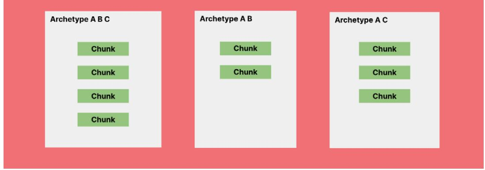

In Unity's ECS, all entities with the same set of component types are stored together in the same "archetype".

<span id="page-16-0"></span>

## **Chunks**

Within an archetype, the entities and their components are stored in blocks of memory called chunks. Each chunk stores up to 128 entities, and the components of each type are stored in their own array within the chunk. For example, in the archetype for entities having component types A and B, each chunk will store three arrays:

- One array for the entity ID's
- A second array for the A components
- And a third array for the B components

The ID and components of the first entity in a chunk are stored at index 0 of these arrays, the second entity at index 1, the third entity at index 2, and so on.

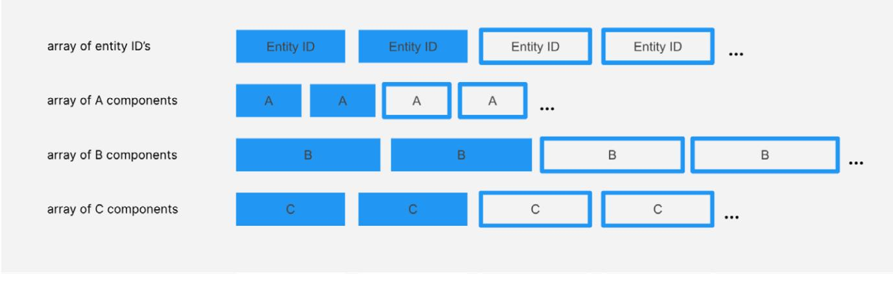

How chunks work in Unity's ECS architecture

A chunk's arrays are always kept tightly packed:

- When a new entity is added to the chunk, it's stored in the first free index of the arrays.
- When an entity is removed from the chunk, the last entity in the chunk is moved to fill in the gap (an entity is removed from a chunk when it's being destroyed or moved to another archetype.)

<span id="page-17-0"></span>

## **Queries**

A primary benefit of the archetype- and chunk-based data layout is that it allows for efficient querying and iteration of the entities.

To loop through all entities having a certain set of component types, an entity query first finds all archetypes matching that criteria, and then it iterates through the entities in the archetypes' chunks:

- Since the components in the chunks reside in tightly packed arrays, looping through the component values largely avoids cache misses.
- Since the set of archetypes tends to remain stable throughout most of a program, the set of archetypes matching a query can usually be cached to make the queries even faster.

```
// A simple example system.
public partial struct MonsterMoveSystem : ISystem
{
 [BurstCompile]
 public void OnUpdate(ref SystemState state)
 {
 // Query that loops through all entities with 
 // a LocalTransform, Velocity, and Monster component
 foreach (var (transform, velocity) in 
 SystemAPI.Query<RefRW<LocalTransform>, RefRO<Velocity>>()
 .WithAll<Monster>())
 {
 // Update the transform position from the 
 // velocity (factoring in delta time)
 transform.ValueRW.Position += 
 velocity.ValueRO.Value * SystemAPI.Time.deltaTime;
 }
 }
}
```
<span id="page-18-0"></span>

### **Job system integration**

As long as entity component types are unmanaged, they can be accessed in Burst-compiled jobs. Two special job types are provided for accessing entities: IJobChunk and IJobEntity.

```
// A simple example system that schedules an IJobEntity.
public partial struct MonsterMoveSystem : ISystem
{
 [BurstCompile]
 public void OnUpdate(ref SystemState state)
 {
 // Create and schedule the job.
 var job = new MonsterMoveJob {
 DeltaTime = SystemAPI.Time.DeltaTime
 };
 job.ScheduleParallel();
 }
}
// A Burst-compiled job that processes every entity that has 
// a LocalTransform, Velocity, and Monster component.
[WithAll(typeof(Monster))]
[BurstCompile]
public partial struct MonsterMoveJob : IJobEntity
{
 public float DeltaTime;
 // Because we wish to modify the LocalTransform, we use 'ref'.
 // We only wish to read the Velocity, so we use 'in'.
 public void Execute(ref LocalTransform, in Velocity)
 {
 transform.Position += velocity.Value * DeltaTime;
 }
}
```
For ease of use, systems can automatically handle job dependencies and job completion across systems.

<span id="page-19-0"></span>

### **Subscenes and baking**

Unity ECS uses subscenes instead of scenes to manage the content of your application. This is because Unity's core scene system is incompatible with ECS.

While entities can't be directly included in Unity scenes, a feature called baking allows for loading entities from scenes and converts the GameObjects and MonoBehaviour components into entities and ECS components.

You can think of subscenes as scenes that are nested inside others and are processed by baking, which re-runs every time you edit a subscene. For every GameObject in a subscene, baking creates an entity, the entities get serialized into a file, and it's these entities that are loaded at runtime when the subscene is loaded, not the GameObjects themselves.

| O Inspector                                               |                        |                         | 0a :                                  | O Inspector                                           | 03                                                            |
|-----------------------------------------------------------|------------------------|-------------------------|---------------------------------------|-------------------------------------------------------|---------------------------------------------------------------|
| P<br>BoxPile<br>V<br>Tag Untagged                         | 4                      | Layer Default           | Static                                | BoxPile<br>From<br>Components                         | Index 707<br>Version 1<br>BoxPile<br>Relationships<br>Aspects |
| 4 2<br>Transform<br>Position<br>Rotation<br>Scale<br>ర్యా | ×<br>49<br>x<br>0<br>X | Y 1.5<br>Y<br>0<br>Y 17 | 3<br>2<br>Z<br>22<br>Z<br>O<br>Z<br>1 | *<br>Local Transform<br>Position<br>Scale<br>Rotation | × 49<br>Y 1.5 Z 22<br>× 0<br>YO ZO                            |
|                                                           |                        | GameObject Data         |                                       |                                                       | ECS Data                                                      |

Left: inspecting a GameObject and right: inspecting an entity that was baked from the GameObject

Which components get added to the baked entities is determined by the "bakers" associated with the GameObject components. For example, bakers associated with the standard graphics components, like MeshRenderer, will add graphics-related components to the entity. For your own MonoBehaviour types, you can define bakers to control what additional components get added to the baked entities.


```
// This entity component type represents an energy shield with hit points, 
// maximum hit points, recharge delay, and recharge rate.
public struct EnergyShield : IComponentData
{
 public int HitPoints;
 public int MaxHitPoints;
 public float RechargeDelay;
 public float RechargeRate;
}
// A simple example authoring component.
// An authoring component is just an ordinary MonoBehaviour
// that has a defined Baker class.
public class EnergyShieldAuthoring : MonoBehaviour
{
 public int MaxHitPoints;
 public float RechargeDelay;
 public float RechargeRate;
 // The baker for our EnergyShield authoring component.
 // This baker is run once for every EnergyShieldAuthoring 
 // instance that's attached to any GameObject in a subscene.
 class Baker : Baker<EnergyShieldAuthoring>
 {
 public override void Bake(EnergyShieldAuthoring authoring)
 {
 // The TransformUsageFlags specify which 
 // transform components the entity should have. 
 // The None flag means that it doesn't need transforms.
 var entity = GetEntity(TransformUsageFlags.None);
 // This simple baker adds just one component to the 
entity.
 AddComponent(entity, new EnergyShield
 {
 HitPoints = authoring.MaxHitPoints,
 MaxHitPoints = authoring.MaxHitPoints,
 RechargeDelay = authoring.RechargeDelay,
 RechargeRate = authoring.RechargeRate,
 });
 }
 }
}
```
<span id="page-21-0"></span>

On the one hand, it's inconvenient in simple cases to not be able to add entities directly in scenes, but on the other hand, the baking process can be useful in more advanced cases. Baking effectively separates authoring data (the GameObjects that you edit in the Editor) from runtime data (the baked entities), so what you directly edit and what gets loaded at runtime don't have to match 1-to-1. For example, you could write code to procedurally generate data during baking, which would spare you from paying the cost at runtime.

#### **Streaming**

Particularly for large detailed environments, it's important to be able to load and unload many elements efficiently and asynchronously as the player or camera moves around the environment. In a large open world, for example, many elements must be loaded in as they come into view, and many elements must be unloaded as they go out of view. This technique is also referred to as streaming.

[Entities are far more suited for streaming](https://docs.unity3d.com/Packages/com.unity.entities@1.2/manual/streaming-scenes.html) than GameObjects because entities consume less memory and processing overhead, and they can be serialized and deserialized much more efficiently.

## EntityComponentSystemSamples Github

The [EntityComponentSystemSamples](https://github.com/Unity-Technologies/EntityComponentSystemSamples/tree/master) Github repository includes many samples that introduce both basic and advanced DOTS features. The readme file for each sample collection provides further details but here's a brief description of some selected samples.

Some of the samples in the Github repo are reproduced in a new Unity Learn course on DOTS, [Get acquainted with DOTS.](https://learn.unity.com/tutorial/65bbbee8edbc2a1bb56409d4?uv=2022.3&projectId=65b3d3cfedbc2a5399ce3740#) See the links under each sample to the Unity Learn tutorial it's featured in (if applicable).

The [HelloCube samples](https://github.com/Unity-Technologies/EntityComponentSystemSamples/tree/master/EntitiesSamples/Assets/HelloCube) are a beginner-friendly entry point for DOTS and demonstrate the most fundamental concepts of the Entities API, such as creating and destroying entities, adding and removing components, and systems that access the entities. Get a breakdown of the sample's content in the [HelloCube walkthrough video](https://youtu.be/32TLgtA9yUM) or go through the step-by-step [HelloCube tutorial](https://learn.unity.com/tutorial/65b3d4f2edbc2a5860dd5d96?uv=2022.3&projectId=65b3d3cfedbc2a5399ce3740) on Unity Learn.

The [baking samples](https://github.com/Unity-Technologies/EntityComponentSystemSamples/tree/master/EntitiesSamples/Assets/Baking) demonstrate [baking](https://docs.unity3d.com/Packages/com.unity.entities@1.2/manual/baking.html), which serializes entity data at build time to be loaded from scenes at runtime.


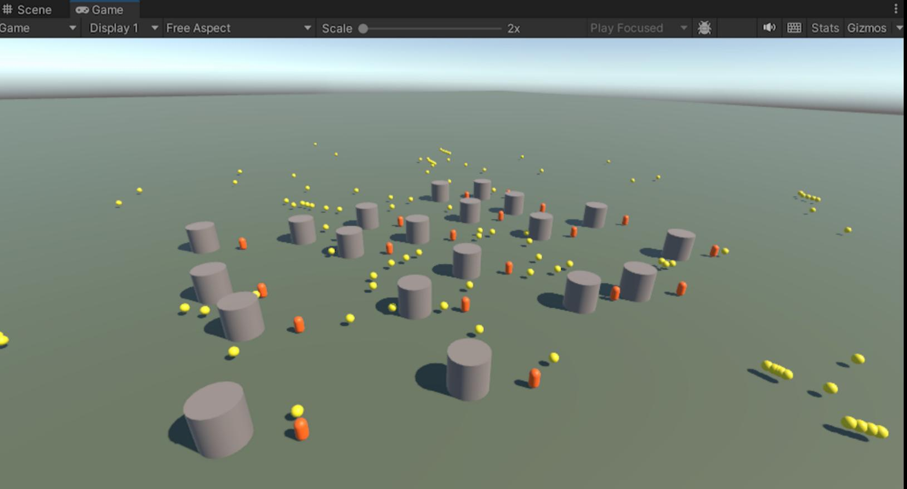

A screenshot from the Kickball tutorial

The [Kickball sample](https://github.com/Unity-Technologies/EntityComponentSystemSamples/tree/master/EntitiesSamples/Assets/Tutorials/Kickball) demonstrates more basics of Entities but with a bit more gameplay than HelloCube. Controls allow the player to move the orange capsules, spawn yellow balls, and kick the balls away from the capsules. The gray cylinders are obstacles that block the movement of the capsules and balls. You can also see the [Kickball walkthrough video](https://www.youtube.com/watch?v=P6_3L7RTcm0).

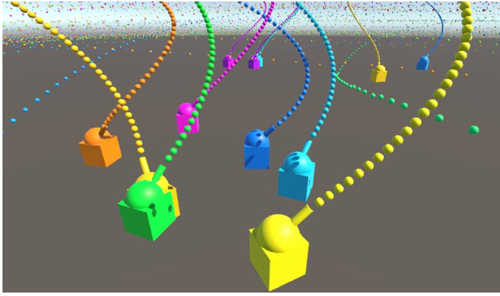

A screenshot from the Tanks tutorial

In the [Tanks sample](https://github.com/Unity-Technologies/EntityComponentSystemSamples/tree/master/EntitiesSamples/Assets/Tutorials/Tanks), tanks move on a plane, spin their turrets, and shoot colored projectiles bringing the job system and entities together in one sample. Your objective is to spawn moving tanks that shoot cannonballs from a spinning turret. Tanks are destroyed when hit by a cannonball and the player controls the movement of one tank. Check out the [Tanks](https://www.youtube.com/watch?v=jAVVxoWU5lo)  [walkthrough video](https://www.youtube.com/watch?v=jAVVxoWU5lo) or follow along in the [Tanks tutorial](https://learn.unity.com/tutorial/65b3e48fedbc2a611fc291a7?uv=2022.3&projectId=65b3d3cfedbc2a5399ce3740) on Unity Learn.

In the [Firefighters sample,](https://github.com/Unity-Technologies/EntityComponentSystemSamples/tree/master/EntitiesSamples/Assets/Tutorials/Firefighters) a fire spreads across a field, and bots form bucket brigade lines to douse the fire. It's a more advanced tutorial that brings many concepts together so we recommend doing the above tutorials first. The project was covered in four sessions as part of the [DOTS bootcamp](https://unity.com/resources/dots-boot-camp-day-1).

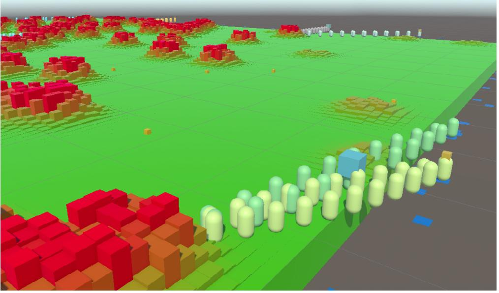

A scene from the Firefighters sample

<span id="page-24-0"></span>

# Entities Graphics

The [Entities Graphics package](https://docs.unity3d.com/Packages/com.unity.entities.graphics@latest) provides components and systems for rendering entities via the Universal Render Pipeline (URP) or the High Definition Render Pipeline (HDRP). Entities Graphics is built around the [BatchRendererGroup](https://blog.unity.com/engine-platform/batchrenderergroup-sample-high-frame-rate-on-budget-devices) API.

The [Entities Graphics samples](https://github.com/Unity-Technologies/EntityComponentSystemSamples/tree/master/GraphicsSamples/URPSamples) demonstrate various graphics features, such as light probes and lightmaps, material property overrides, and LODs.

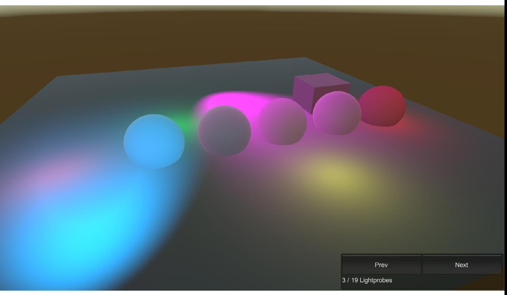

An Entites.Graphics sample scene in the [EntityComponentSystemSamples repo](https://github.com/Unity-Technologies/EntityComponentSystemSamples)sitory

<span id="page-25-0"></span>

# Physics

The [Unity Physics package](https://docs.unity3d.com/Packages/com.unity.physics@1.2/manual/index.html) provides rigid body simulation and collision checks.

Unity Physics supports swapping in alternate "backends" while maintaining the same surface level API, allowing you to swap physics implementations without changing your own code or assets.

The default backend provided in the package is deterministic, meaning that given the same initial conditions and inputs, it will produce the same results.

The [Havok Physics](https://docs.unity3d.com/Packages/com.havok.physics@1.2/manual/index.html) package provides an alternative backend based on the proprietary Havok Physics engine that powers many industry-leading AAA games.

The [Physics samples](https://github.com/Unity-Technologies/EntityComponentSystemSamples/blob/master/PhysicsSamples/README.md) illustrate many features of the package, including colliders, mass and motion properties, material properties, events, joints and motors, and more.

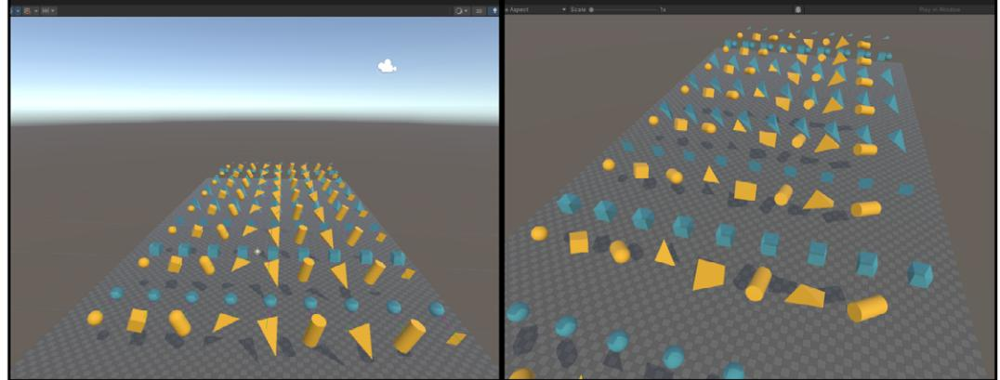

A Physics sample scene in the [EntityComponentSystemSamples repo](https://github.com/Unity-Technologies/EntityComponentSystemSamples)sitory

## Netcode for Entities

The [Netcode for Entities](https://docs.unity3d.com/Packages/com.unity.netcode@1.2/manual/index.html) package is one of two netcode solutions provided by Unity. Unlike the other solution, [Netcode for GameObjects,](https://docs-multiplayer.unity3d.com/netcode/current/about/) Netcode for Entities uses an authoritative server and supports client-side prediction, making it better suited for fast-paced competitive games.

### **Authoritative server**

Rather than splitting authority of what is happening in the game across the player machines, an authoritative server runs the full game simulation itself and dictates what is happening in the game. The clients send player input to the server, the server updates the game simulation, and the server sends new snapshots of the game state back to the clients. This is the simplest way to implement networked game logic and the one least prone to exploitation by cheaters.

<span id="page-26-0"></span>

## **Client-side prediction**

Since it takes time for data sent from the server to reach the clients, the state which the client has received always lags behind the server. For many elements in a game, this lag might be acceptable, but for others, like the player's character, such lag can ruin the feel of the game and make it difficult to play.

Client-side prediction can solve this problem. For designated elements like the player's character, the client will attempt to predict the state a fraction of a second into the future. As long as these predictions match the state on the server accurately and consistently enough, the game will feel much more like a zero-lag experience.

On top of these two core features, Netcode for Entities can also scale better than Netcode for GameObjects and provides better means to optimize bandwidth.

A good introduction to Netcode for Entities is the [Netcode for Entities samples](https://github.com/Unity-Technologies/EntityComponentSystemSamples/blob/master/NetcodeSamples/README.md) repository. These samples demonstrate many basic and advanced features, including syncing, connection flows, integration with Unity Physics, and more. Start with the [Networked Cube tutorial,](https://docs.unity3d.com/Packages/com.unity.netcode@1.2/manual/networked-cube.html) which covers:

- Establishing a connection with the server.
- Communicating with the server.
- Spawning synchronized entities on the server.
- Creating standalone builds of the server and client.
- Running the server and a client in Play mode within the Editor.

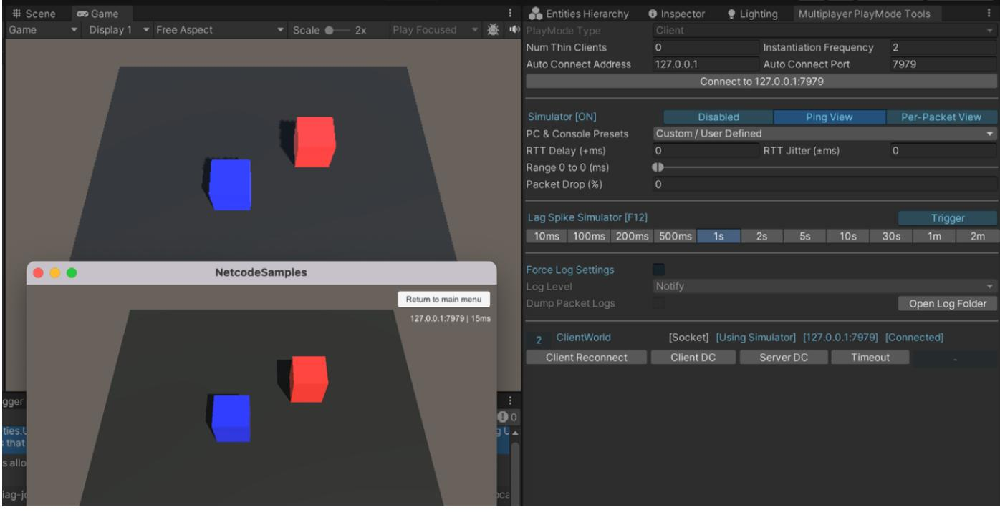

The Networked Cube tutorial running in the Editor and as a standalone build

<span id="page-27-0"></span>

#### ECS Network Racing sample


The ECS Network Racing Sample features car racing multiplayer mechanics

The [ECS Network Racing sample i](https://github.com/Unity-Technologies/ECS-Network-Racing-Sample)s a lobby-based multiplayer car racing sample featuring Unity Physics and [Vivox](https://unity.com/products/vivox-voice-chat) voice chat.

# Character Controller

The [CharacterController package](https://docs.unity3d.com/Packages/com.unity.charactercontroller@latest) provides an ECS-based implementation of first- and thirdperson character controllers that work with Unity Physics and Netcode for Entities. The controllers support various common character behaviors, like sprinting and double jumping. You can also try the [CharacterController tutorial and samples](https://github.com/Unity-Technologies/CharacterControllerSamples) for more learning examples.


The character controller package is available in the Unity Asset Store.

<span id="page-28-0"></span>

# What's on the DOTS roadmap?

The core DOTS packages are production-ready but a few of the complementary DOTS-based systems are still in development. At the time of writing (spring 2024) here is the status of related systems.

#### **Animation**

Unity is developing a skinned mesh animation system to work with entities, but, as of the time of writing this guide, it's not yet available in current versions of Unity.

In the meantime, the most common solution is to render animated characters as GameObjects whose transforms and animation states are synced from entities. In other words, the game simulation is fully implemented in entities, but presentation of the animated characters is done with GameObjects (for a simple demonstration of the idea, see the "AnimateGameObject" sample in the [sample repo](https://github.com/Unity-Technologies/EntityComponentSystemSamples/tree/master)sitory). This solution does require some extra coding and induces some overhead, but it should suffice for most games.

Alternatively, some game makers and asset developers have implemented their own custom animation solutions. The community offers several different solutions of which some are available on the [Unity Asset Store](https://assetstore.unity.com/?q=ECS%20animation&orderBy=1).

#### **User Interfaces**

There is currently no ECS-based UI system. Instead, ECS-based games can use the existing GameObject-based UI Toolkit (see the [Firefighters tutorial](https://github.com/Unity-Technologies/EntityComponentSystemSamples/blob/master/EntitiesSamples/Assets/Tutorials/Firefighters/README.md) for a simple example of coordination between UI Toolkit and ECS). To learn more about using UI Toolkit in your games see the following advanced resources:

- [User interface design and implementation in Unity](https://unity.com/resources/user-interface-design-and-implementation-in-unity?isGated=false)
- [UI Toolkit Sample Dragon Crashers](https://assetstore.unity.com/packages/essentials/tutorial-projects/ui-toolkit-sample-dragon-crashers-231178)
- [QuizU A UI Toolkit sample](https://assetstore.unity.com/packages/essentials/tutorial-projects/quizu-a-ui-toolkit-sample-268492)
- [QuizU article series on Discussions](https://discussions.unity.com/t/welcome-to-the-new-ui-toolkit-sample-project-quizu/308607)

Reference [the DOTS roadmap](https://unity.com/roadmap/unity-platform/dots) to keep up to date on the latest plans for Unity ECS and DOTS.

<span id="page-29-0"></span>

# Evaluating DOTS for your project

If your code is causing CPU bottlenecks, you can consider reimplementing it as Burstcompiled jobs. Not only will Burst-compiled code often run multiple times faster than the Mono- or even IL2CPP-compiled equivalent, jobs allow you to split your workloads across all cores of the CPU.

The good news is that Burst-compiled jobs can usually be integrated into the majority of existing projects with relative ease, even if a project otherwise makes no use of DOTS. Aside from possibly having to copy data into and out of unmanaged collections, rewriting existing code as Burst-compiled jobs generally requires no significant code restructuring.

This is less true for the Entities package. While it's sometimes possible to selectively integrate entities for implementing specific features, ECS architecture tends to impose its own code structure on the whole project.

Here are four good reasons for why you might want to build a new project using Entities:

- The project will have many static elements, such as for rendering a large, detailed environment. The [original Megacity project](https://www.youtube.com/watch?v=KgcU2HBOXAw) demonstrates a complex environment made out of entities.
- The project will have many dynamic elements with computationally heavy behaviors. A real-time strategy game, for example, often needs to compute pathfinding for hundreds or thousands of units.
- You prefer the ECS way of structuring data and code, which is arguably easier to reason about and maintain than the more common object-oriented alternative. At the very least, ECS generally makes it easier to profile and identify bottlenecks.
- The project is a competitive multiplayer game with fast action, such as a shooter, and requires authoritative servers and client-side prediction for a good player experience (as stated above, these features are supported in Netcode for Entities but not Netcode for GameObjects).

On the other hand, many games are bottlenecked primarily on the GPU, in which case Entities and the rest of the DOTS packages and related technologies might not help much because DOTS only improves CPU efficiency. Still, if DOTS can help you do the same amount of work in less CPU time, that leaves more headroom for additional features, and extra headroom can also help greatly if you later decide to target lower-powered devices.

The following section highlights some of the games that use Unity ECS and DOTS technologies.

# <span id="page-30-0"></span>Made with DOTS

Over the last several years, development teams have seen their multiplatform games benefit from using DOTS packages and technologies. As you'll learn from the following excerpts from customer stories, each team carefully thought through how their game could benefit from DOTS before deciding to implement it.

You'll find more Unity customer stories and profiles in the [Unity Resources hub.](https://unity.com/resources)

<span id="page-31-0"></span>

## Made with DOTS: *Bare Butt Boxing*, by Tuatara Games

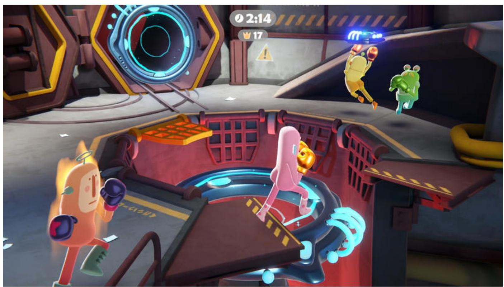

*Bare Butt Boxing* by Tuatara Games, [made with Unity](https://unity.com/case-study/bare-butt-boxing), available for PC and console

[Tuatara Games](https://tuataragames.com/games/bare-butt-boxing) built Bare Butt Boxing using Unity's DOTS from the very start of development. "Since this is our first game as a new team, we wanted to do early access with a foundation strong enough for us to pivot the design into the right direction," says software engineer Hendrik du Toit. "DOTS allowed us to modularize our systems in a way that we can test gameplay ideas without weeks of rewriting code."

Tuatara's data-oriented design approach simplifies iteration and allows them to be flexible with optimization. "Having ECS means we can adjust runtime data layout easily without impacting serialized data," says game programmer Ewan Argouse.

"ECS has helped us to divide the game into multiple layers without trouble. The game design can be simple and related to the simulation directly, and we can create systems on top of that to present it nicely…thanks to that, the presentation can be complex while our simulation can be client-predicted without being too heavy on the CPU."

- Ewan Argouse, game programmer, Tuatara Games

<span id="page-32-0"></span>

## Made with DOTS: *Histera*, by StickyLock Games

*Histera* by StickyLock Games, [made with Unity,](https://www.youtube.com/watch?v=Plb5LlABHhk) and available for PC via Steam Early Access

["Histera](https://histera.com/) started out as an extraordinary idea, and that was to innovate the FPS genre as a whole. How we've done that is…through the 'glitch'...the glitch is our main USP. (It) basically takes a section of the map and changes that to a completely new era. So you can go from a prehistoric era up to a future era and it will completely change the layout as well.

The reason we chose to go with DOTS was that at the time, we were looking at networking solutions, however there weren't a lot of options for us. Since we're going with a first-person shooter game, we knew that peer-to-peer wouldn't be the reliable option for us. We wanted a dedicated game server option. There was a Unity blog detailing the release of Unity Netcode and DOTS…they also released a few samples. And when we looked into those, we got quite intrigued because they showcased that we would be able to make an FPS with the tech.

Once we dove deeper into those (DOTS) packages, we found that it was very interesting for us from a developer perspective…it was a completely new paradigm. Instead of being object-oriented, it was data-oriented…after a lot of talking and discussing, we wanted to push forward and invested in our knowledge on DOTS and ECS."

- Jamel Ziaty, producer, StickyLock Games

<span id="page-33-0"></span>

# Made with DOTS: *V Rising*, by Stunlock Studios

*V Rising* by Stunlock Studios, [made with Unity,](https://www.youtube.com/watch?v=HgCLe16Gmos) available for PC

When [Stunlock Studios](https://www.stunlock.com/) set out to build *V Rising*, they realized quickly that the scale of their vision would require a different design pattern from their previous titles. "We wanted the world to feel alive with lots of destructibles and interactables," says cofounder and technical director Rasmus Höök.

Höök started experimenting with DOTS "because its use cases seemed to fit perfectly with the problems we were trying to solve." Using DOTS and ECS, Stunlock decreased server strain and minimized client CPU resources, resulting in more concurrent players, lowered system requirements, and a robust tech stack that can scale up to meet Stunlock Studios's creative vision.

"ECS offers a significant advantage with its clear separation between Editor data and runtime data. When working in the Editor, we create authoring prefabs, which are essentially standard GameObjects with MonoBehaviors. However, these prefabs are solely for editing purposes and are not directly used in the game itself. Instead, they go through a process called baking where they are converted into runtime components. Since the authoring prefabs are only used in the Editor it allows us to add functionality and data to them to improve the workflow without worrying about cluttering the actual game.

Because of this, we can freely modify and optimize the runtime components without impacting the Editor data. This separation has greatly helped us maintain a complex project like *V Rising*."

– Rasmus Höök, technical director, Stunlock Studios

<span id="page-34-0"></span>


# Made with DOTS: *Zenith: The Last City*, by Ramen VR

As systems-based games, MMOs require strong, scalable technical foundations. Early in development, [Ramen VR](https://zenithmmo.com/) organized Zenith's systems using MonoBehaviors, but running logic hundreds of times across hundreds of identical GameObjects was inefficient.

They leveraged Unity's ECS framework to avoid the drawbacks of object-oriented programming. "An MMO is a great application for ECS," [CTO Lauren] Frazier notes. "Zenith requires thousands of Entities to coexist at the same time, and ECS allows us to run at scale."

In the new workflow, every "actor" GameObject (players, mobs, collectibles) has a corresponding ECS Entity. The ECS runs through GameObjects and checks for relevant tags, triggering logic whenever they're found.

"It was nice to be able to pick the workflow appropriate to the situation. We could have done pure Objects or pure Entities – but I don't think you should have to choose," says Frazier."

– Lauren Frazier, CTO, Ramen VR

Made with DOTS: Megacity Metro sample

<span id="page-35-0"></span>

The Megacity Metro sample

Unity's Megacity Metro sample is a multiplayer and mobile-focused spin on the original Megacity sample. Megacity Metro is built with URP, Entities, Netcode for Entities, and Unity Physics, and runs on a range of devices, from low-end mobile to high-end console platforms. It supports competitive cross play for over 100 players and showcases [Unity Gaming Services](https://unity.com/solutions/gaming-services) like Authentication, Game Server Hosting, Matchmaker, and Vivox.

You can learn more about Megacity Metro and download the project [here](https://unity.com/resources/megacity-metro).

# <span id="page-36-0"></span>Appendix: Concepts related to ECS

The data-oriented elements of DOTS make it more hardware friendly than the object-oriented programming approach you know from Monobehaviour projects. It can help to have a good understanding of some key concepts related to, and impacted by, DOD that are normally less relevant for your C# programming in Monobehaviour-based projects.

# Memory allocation and garbage collection

In modern operating systems, programs run as separate processes, where the memory of each process is managed by the operating system. When a process wants more memory, it has to request it from the operating system, upon which the operating system will give the process a contiguous block of memory. This is called memory allocation.

When a process is terminated, the operating system will reclaim the memory, freeing it up to be used elsewhere. For long-running programs, however, it often makes sense for the program to hand back blocks of memory which it is no longer using. This is called memory deallocation or freeing. In simple short-lived programs, it's often sufficient to only allocate memory without ever freeing it. However, if a long-running program continues to make new allocations but neglects to ever free them, the program might end up using an unreasonable amount of memory. These situations are called memory leaks, and can lead to worse performance and instability.


Programs often use their own internal allocators, which can work in the following way:

- 1. The program allocates a large block of memory from the operating system.
- 2. The program's own internal allocator tracks which ranges within the block are currently in use.
- 3. When the program needs more memory, it requests it from the internal allocator rather than from the operating system.
- 4. When these internally allocated blocks of memory are no longer needed, the program should notify its allocator to free the memory.

Internal allocators have some advantages.

- Unlike allocating and deallocating from the operating system, allocating and deallocating from an internal allocator does not generally require expensive system calls.
- A program can use multiple custom allocators to better accommodate different use cases: Some allocators are more appropriate for small, short-lived allocations, while other allocators are more appropriate for large, long-lived allocations. For example, a so-called "arena allocator" frees all of its allocations at the same time, so its internal logic and bookkeeping can be very simple and cheap.

In many of today's popular languages, including C#, the runtime uses a garbage collector that will scan memory to find unused allocations and free them. Compared to manual allocation, this automated way is more convenient and makes memory leaks and other memory-related issues easier to avoid. On the downside, garbage collection incurs overhead and requires interrupting the program execution, which may cause noticeable pauses that negatively affect the player experience.

In DOTS, entities and the native collections are unmanaged, meaning they are not allocated or managed by the runtime or its garbage collector:

- For entities, the memory is allocated and freed for you by the EntityManager, so your entities only leak memory if you neglect to destroy them when they are no longer needed. In practice, such cases tend to be noticeable, so this mistake is easy to detect and correct.
- For the native collections, DOTS provides several allocators with different trade-offs. The **Allocator.Temp** allocator, for example, provides very cheap allocations that are disposed of automatically at the end of the frame or the job in which it was allocated. The **Allocator.Persistent** allocator, in contrast, provides more expensive allocations that live indefinitely until manually freed. Unlike allocations from Allocator.Temp, allocations from Allocator.Persistent can be large, and passed into jobs. Other allocators include **Allocator.TempJob** and the **WorldUpdateAllocator**.

See the [documentation](https://docs.unity3d.com/Manual/performance-garbage-collector.html) on Unity's garbage collector for more information.

<span id="page-38-0"></span>

# Multithreaded programming

Most modern CPUs have more than one core, and putting these additional cores to work can greatly boost performance of a game that is CPU heavy. However, multithreading can be difficult and unsafe because it requires a lot of low-level manual programming that might be unfamiliar territory for many C# developers. In DOTS, the [C# job system](https://docs.unity3d.com/6000.0/Documentation/Manual/JobSystem.html) helps you write safe multithreaded code in a way that is easy and that avoids common pitfalls, but this section should help you understand the underlying issues.

When a process is spawned by the operating system, it starts off with a single thread of execution. Through system calls, a process can spawn additional threads which will belong to the same process and thus share the same memory.

Each logical core of the CPU can run one thread at a time, and the operating system controls which threads run on which cores and when. At any time, the operating system can interrupt a running thread and suspend it so that another thread can use the core. When two threads access the same resource (namely data), the danger is that one thread mutates the resource when the other thread is not expecting it to. In general, a thread should only read and modify a shared resource within a "critical section" – a span of code within which the thread has exclusive access to the shared resource.

To control access across threads, a shared resource is governed by some kind of [synchronization primitive,](https://en.wikipedia.org/wiki/Event_(synchronization_primitive)) such as a mutex. However, these synchronization primitives generally require all threads that use them to follow a strict protocol, and failing to do so can make the primitives ineffective or hang the program.

Another issue is that certain system calls may block the calling thread, meaning suspend its execution. For example, when a thread invokes a system call to read a file, the data probably isn't yet sitting in memory, so it must be copied off a device into memory first before the system call can return. Because the wait for the data may be very long (in CPU terms), the operating system may block the calling thread while the data is being loaded, and another thread can run on the CPU core in the meantime. Only once the data is ready will the operating system unblock the thread and allow it to resume execution.

One use case, then, for multithreading is to do longer-running blocking operations on "background threads", such as reading files and writing files, while continuing to do work on the "main thread". An interactive program, for example, may want to load a file in the background while the main thread still responds to user input and redraws the screen.

In other cases, you may simply want to split a program's CPU workload across multiple cores to get the work done faster. Data compression, for example, is very CPU intensive, so it can usually benefit from multithreading.

A consideration to keep in mind is that the CPU cores must contend with each other for use of the storage devices, system memory, and other system resources. For example, if two threads try to concurrently access memory, they cannot do so at the same moment but instead must take turns. Fortunately, these overlaps are resolved at the hardware level, but the problem

<span id="page-39-0"></span>

remains that each thread's memory access slows down the overlapping memory access of all other threads. Particularly then, for a task which requires heavy amounts of memory access relative to CPU computation, splitting the work across multiple threads will tend to reap diminishing returns.

For example, you might assume that a task split across 10 threads should run 10 times faster than the same task running on just one thread, but this theoretical limit is rarely achieved in practice, thanks to memory contention. Instead, 10 threads might more realistically get you perhaps a 5-7x boost (though, again, this depends upon the specific scenario). In fact, if the task requires a high ratio of memory access relative to computation work, the performance might improve by using *fewer* threads, because the fewer the number of threads the less memory contention.

## Memory and CPU cache

Most of today's CPUs have one to three levels of cache, usually designated L1, L2, and L3.

When the CPU executes an instruction that reads an address of system memory, the hardware first checks if a copy of the data at that address is sitting in the L1 cache. If not, the hardware then checks L2 cache (if it exists), and then L3 cache (if it exists). If no copy currently sits in any cache the hardware will actually read system memory itself. Upon reading the data, the hardware will copy it into a portion of the lower cache levels, e.g., data read from L3 will be copied into L1 and L2, and data read from system memory will be copied into all cache levels. This caching strategy makes sense because when an address is read, it's usually likely that the same address will be read again shortly thereafter. By copying the data into cache, the data can likely be read directly from cache the next time it is needed.

Of course, not all of system memory can fit in cache: Each level of cache is smaller than the one above it, and the largest cache is still much smaller than all of system memory. Therefore, when a portion of memory is copied into cache, it must overwrite some other portion of memory that was previously cached.

When data is read from cache, it's called a "cache hit". When data must be read from system memory itself because a copy is not currently cached, it's called a cache miss.

The precise performance characteristics of caches varies greatly among different chips but roughly, L1 will be at least a few times faster than L2, L2 will be at least an order of magnitude faster than L3, and L3 will be at least twice as fast as system memory. In total, the CPU will likely access data in L1 cache at least two orders of magnitude faster than it will access data in system memory. Because the speed gap between lower cache levels and system memory is so great, minimizing the number of cache misses triggered in your program is a key performance consideration.


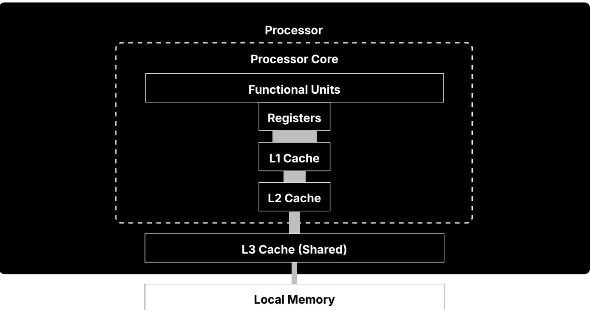

#### Levels of cache; Source: <https://tech4gamers.com>

Thanks to a hardware feature called prefetching, the simplest and most effective way to minimize cache misses is to access addresses of memory sequentially rather than jumping around randomly. Therefore, cache-efficient data structures store their elements tightlypacked and contiguous in memory. In other words, the data is stored in arrays.

When you start reading memory addresses in sequence, the hardware notices this pattern and will start reading ahead and copying the memory into cache, in the expectation that you'll keep going. This may end up as a bit of wasted effort in cases where the extra data isn't needed, but in cases where you are reading through an array, this prefetching behavior will put data in cache right before the CPU needs it. So aside from a possible initial cache miss when you read the first bytes of an array, an array can be read without triggering cache misses. As the CPU train speeds along, [the tracks are laid right in front of the train,](https://www.youtube.com/watch?v=jrmZIgVoQw4&t=91s) just in time.

Managed C# objects like GameObjects and MonoBehaviours are separately instantiated, and therefore might end up stored in different parts of memory. Consequently, traversing through many managed objects typically requires jumping around memory and thus triggering many cache misses.

In DOTS, entities and their components are tightly packed in contiguous arrays by design, allowing them to be sequentially traversed with minimal cache misses.

See this talk by Scott Meyers for further information about memory and cache: [CPU Caches](https://www.youtube.com/watch?v=WDIkqP4JbkE)  [and Why You Care.](https://www.youtube.com/watch?v=WDIkqP4JbkE)

<span id="page-41-0"></span>

# Costs of object-oriented programming

A common challenge with object-oriented programming (OOP) is its many definitions. Some insist that OOP is all about inheritance, or polymorphism, or encapsulation, or the combination of the three, while others offer less conventional theories. Here is the definition according to Wikipedia:

"Object-oriented programming (OOP) is a programming paradigm based on the concept of objects, which can contain data and code: data in the form of fields (often known as attributes or properties), and code in the form of procedures (often known as methods). **In OOP, computer programs are designed by making them out of objects that interact with one another.**" – [Wikipedia](https://en.wikipedia.org/wiki/Object-oriented_programming)

In other words, an object-oriented program is composed of interacting "objects", where each object is an encapsulated unit of data and code that has some degree of autonomy and independence from the others. Much like the programs on a network cooperate by sending each other messages, the objects in an object-oriented program cooperate by invoking each others' methods, and in fact, it's the interactions of the objects that really defines objectoriented programming, not the individual objects themselves.

The theoretical benefits of OOP include:

- **Composability**: Programs made out of objects can be incrementally assembled and modified.
- **Reconfigurability**: Features can be easily added, removed, and modified by inserting, removing, and replacing objects.
- **Code reuse**: Objects can be easily reused between programs.
- **Intuitiveness**: Real-world things and processes naturally correspond to objects.
- **Abstraction**: Objects allow the programmer to solve problems at a high-level without being distracted by low-level details.

Steve Jobs elaborated on this last point in an interview in the June 16, 1994 edition of *[Rolling Stone](https://www.rollingstone.com/culture/culture-news/steve-jobs-in-1994-the-rolling-stone-interview-231132/)*:

"Objects are like people. They're living, breathing things that have knowledge inside them about how to do things and have memory inside them so they can remember things. And rather than interacting with them at a very low level, you interact with them at a very high level of abstraction, like we're doing right here.

Here's an example: If I'm your laundry object, you can give me your dirty clothes and send me a message that says, "Can you get my clothes laundered, please." I happen to know where the best laundry place in San Francisco is. And I speak English, and I have dollars in my pockets. So I go out and hail a taxicab and tell the driver to take me to this place in San Francisco. I go get your clothes laundered, I jump back in the cab, I get back here. I give you your clean clothes and say, "Here are your clean clothes."

You have no idea how I did that. You have no knowledge of the laundry place. Maybe you speak French, and you can't even hail a taxi. You can't pay for one, you don't have dollars in your pocket. Yet I knew how to do all of that. And you didn't have to know any of it. All that complexity was hidden inside of me, and we were able to interact at a very high level of abstraction. That's what objects are. They encapsulate complexity, and the interfaces to that complexity are high level."

#### **Performance costs of OOP**

On the downside, OOP tends to incur a number of performance costs:

- **Scattered data layout:** OOP code is often split into many small objects, and the data often ends up scattered throughout memory (which leads to cache inefficiencies, as discussed in prior sections).
- **Excessive abstraction:** Object-oriented design often encourages layers of delegation, where the higher levels defer the real work to lower levels, resulting in many objects and methods that do little actual work.
- **Complex call chains:** Thanks to the many layers of abstraction and a preference for small functions, call chains get very complex.
- **Virtual calls**: Not only do virtual dispatch tables incur overhead over regular function calls, virtual calls cannot normally be inlined (though some JIT compilers may do so at runtime)
- **Bad allocation patterns:** The complex code paths that OOP encourages often make it difficult to reason about object lifetimes, so OOP code tends to rely upon frequent, small allocations and garbage collection rather than more efficient alternatives.
- **One-at-a-time processing:** Because the code which directly manipulates an object is part of the object itself, there's a natural tendency in OOP to process objects one-by-one rather than in large batches.

#### **Structural costs of OOP**

Even if we're happy to sacrifice optimal performance for the sake of making programs easier to write and maintain, OOP can also have shortcomings in those areas as well. Here are a few:

#### **1. Entangling your data and code makes both of them messier and more complicated.**

It is often claimed that OOP prioritizes data over code:

"Object-oriented programming (OOP) is a computer programming model that organizes software design around data, or objects, rather than functions and logic. […] OOP focuses on the objects that developers want to manipulate rather than the logic required to manipulate them."

– Alexander S. Gillis, *[What is Object-Oriented Programming](https://www.techtarget.com/searchapparchitecture/definition/object-oriented-programming-OOP)*, published on TechTarget Network.


However in reality, OOP entangles data and code together: If an object's capabilities must directly follow from its data and vice versa, what an object can do is integral to its definition and can't be separated from the object's data.

This entanglement often leads to questionable design choices, such as:

- Objects with code that really should just have data.
- Objects with data that really should just have code.
- Objects that group data together for the purposes of code.
- Objects that group code together for the purposes of data.
- Code that is split across objects for the sake of data.
- Data that is split across objects for the sake of code.

#### **2. Replacing concentrated complexity with scattered complexity increases the overall complexity.**

According to the rules of object-oriented design, an object with too many "responsibilities" should be broken up into smaller objects. However, when you break up large things into smaller pieces, you may end up just scattering the complexity around rather than reducing the overall complexity. In fact, a code base with many small pieces often makes it hard to discern what purpose any one piece of data or code serves and hard to find the parts of code relevant to a given feature.

So while object-oriented design aims to bring clarity to your code as long as you correctly delegate responsibilities amongst a properly designed set of objects, the object-oriented design process can itself often be burdensome and fraught with conjecture, and the typical resulting program structures become excessively fractured.

#### **3. Objects make it difficult to track which code accesses which data**

Understanding a program ultimately boils down to understanding its data and how that data gets transformed. The easier it is to reason about the data, the easier it is to reason about the program. Whether adding features or fixing bugs, the programmer needs to be able to determine which code affects a given piece of data and, from the other perspective, which data is affected by a given piece of code.

In an object-oriented program, the more connected the objects, the more difficult it is to make these determinations. Although object encapsulation may keep direct access to a piece of data private, any indirectly connected object may have indirect access through some path of public method calls. For example, when debugging why a value is being incorrectly set, identifying all relevant paths of code may require a lot of detective work. In contrast, in a strictly procedural program, identifying all paths of code that may affect a piece of data usually requires considering many fewer possibilities (as long as the program does not use global variables recklessly).

<span id="page-44-0"></span>

# Data-oriented design

The term data-oriented design (DOD) was coined in the 2000's to describe a set of ideas emerging at the time among some game programmers and others interested in high performance software. No one source has the authoritative definition of data-oriented design, but these resources perhaps come the closest:

- ["Data-Oriented Design and C++"](https://www.youtube.com/watch?v=rX0ItVEVjHc) and [Building a Data-Oriented Future:](https://www.youtube.com/watch?v=u8B3j8rqYMw) Two talks by Mike Acton
- [Data-Oriented Design:](http://www.dataorienteddesign.com/dodbook/) A book by Richard Fabian
- [Data-Oriented Design Resources:](https://github.com/dbartolini/data-oriented-design) A collection of links about DOD

Here, rather than give a theoretical account, we'll just distill DOD into several points of practical advice.

## **Design your data before designing your code**

The central premise of DOD is that **data is at least as important as code**. At both the macro and micro level, **programs are ultimately about transforming and producing data**.

So the nature of your data should dictate the structure of your code rather than the other way around. This is true not just at the beginning of a project but at all stages, so when adding or changing features, you should first reevaluate the structure of your data before restructuring the code.

Note that this conflicts with object-oriented design, where objects inextricably link data and code together. Mixing the design of data with concerns about code complicates the design process and often leads to suboptimal design choices. Conversely, allowing data the freedom to change without immediate concern for code simplifies the design process and typically produces simpler, more optimal data.

## **Prefer simple data**

As a general tendency, simple data leads to simple and efficient code. In particular, you should favor arrays over hierarchical structures and graph structures: Arrays are the simplest way to store many elements of data, and sequentially looping through flat arrays is the most efficient way to access memory.

You should also be careful about creating connections between elements of data (*via* pointers and array indexes) that aren't necessary. Correctly maintaining these connections complicates your code, and traversing connections requires suboptimal random lookups.


## **Think of your code as a data pipeline**

Once you have a rough draft design of your data, the next question is what transformations your data must undergo:

- In a server, client requests and database data are transformed into server responses.
- In a compiler, source code is transformed into machine code or some kind of intermediate code.
- In an audio encoder, audio data of one form is transformed into another.
- In a video game, the user input and game state of one tick is transformed into a new game state, which is then transformed into a new rendered frame.

Of course, these macro-level transformations break down into a number of substeps, but the goal remains the same: For some beginning state of the data, you simply need to connect the dots to reach the expected end state. The code can then be naturally structured as a "data pipeline" in which each step transforms or produces data to be handed to later steps of the pipeline.

This description of programming may sound too simple and obvious, but compared to other theories of how to make software, it offers great clarity. Once you have well-defined start and end points, figuring out exactly how to get from point A to B is a very concrete, tractable problem, and each separate transformation can be written and rewritten independently from the rest.

This model makes working solutions not only easier to create but also easier to optimize:

First, identifying bottlenecks in a sequential series of steps is as simple as profiling all the steps. A minority of steps will usually account for most of the cost, giving you a clear idea of where optimizations would be most impactful. Therefore, it's important to consider the cost vs gains when prioritizing your optimization efforts and [being pragmatic in your performance](https://blog.unity.com/engine-platform/profiling-in-unity-2021-lts-what-when-and-how)  [optimization process](https://blog.unity.com/engine-platform/profiling-in-unity-2021-lts-what-when-and-how).

Second, the pipeline model makes it easier to find optimization opportunities. Very often you will find cases where:

- Certain data should be transformed into an intermediate form that lends itself to more efficient processing by later steps.
- Data that is redundantly produced by multiple steps should instead be cached once in an earlier step.
- Separate steps that access the same data should wholly or partly be consolidated into fewer steps to reduce the overhead of repeated access.
- Some elements of data that are processed one-by-one should instead be processed *en masse*, which generally leads to more efficient memory access, less branching, and less function call overhead, among other efficiencies.


Lastly, a data pipeline lends itself to parallelization: As long as you have clear separation of which steps touch which data, it's easy to identify which steps can be safely processed concurrently.

## **Measure, estimate, and budget performance at all stages of development**

A common mistake in game development is waiting to fix performance at the end of a project. Late optimization work is both costly and risky because:

- Many optimizations are harder to do late in the project.
- Late optimization takes an unpredictable amount of time and effort.
- Late optimization might fail to achieve acceptable results.

Instead of waiting, the healthier practice is to concern yourself with performance from the very beginning of a project. Even if you're willing to tolerate suboptimal performance throughout your prototyping and beta phases, you should at the very least continuously reestimate the needs of your project and establish a performance budget. How much memory, CPU, GPU, storage space, and network bandwidth can you afford for each feature and for the game as a whole? Do the target numbers differ across your target platforms? These are questions that you should reassess at all stages of development.


To learn more about profiling check out our 70+ page *[Ultimate guide to profiling Unity games](https://unity.com/resources/ultimate-guide-to-profiling-unity-games)* which brings together advanced knowledge and advice from external and in-house Unity experts on how to profile an application in Unity, manage its memory, and optimize its power consumption from start to finish.


## **Prefer specific solutions over abstractions**

In programming, "abstractions" are generalized solutions that hide internal details behind simplified exteriors. Abstractions come in various forms, including functions, objects, libraries, frameworks, programming languages, and even game engines.

While some degree of abstraction is sensible, excessive enthusiasm for abstraction can cause problems:

- A major reason to use off-the-shelf abstractions, like libraries, frameworks, or game engines, is that they can spare you from difficult and time-consuming implementation work. However, a cost of this convenience is often awkward mismatches between the provided solution and your specific needs. Ultimately, bending an off-the-shelf abstraction to your purposes may actually end up being more work than just writing your own specific solution.
- Abstractions often incur many hidden performance costs, like heavy memory footprint or CPU overhead, costs which are paid ultimately for the sake of features you may not even be using.
- In your own implementations, it's tempting to create an abstract solution that generalizes beyond your current needs in anticipation that it may be useful later in the project. More often than not, however, this kind of speculative work ends up creating more work than it solves, and the resulting solution is often suboptimal (or at least hard to optimize). Abstractions, in fact, may actually make change *more* difficult when you later find that your requirements no longer neatly fit the abstraction.

Instead of worrying about how your requirements might change later, you're almost always better off solving for your current requirements as you currently understand them. Embrace iteration: You won't fully understand your problem until you've tried to solve it, and you can simply wait to change your code later after your requirements actually change. What they say about writing in general applies to writing code: Good writing is rewriting. And what makes code easy to rewrite better than anything else? Simplicity.

If you feel tempted to abstract, the best advice is to wait: Solve for at least a few specific cases first, and only then consider combining their solutions into an abstraction. As Richard Fabian [writes:](https://www.dataorienteddesign.com/dodbook/node2.html#:~:text=Data%2Doriented%20design%20is%20current,handle%20whatever%20will%20come%20along.)

"Data-oriented design is current. It is not a representation of the history of a problem or a solution that has been brought up to date, nor is it the future, with generic solutions made up to handle whatever will come along. Holding onto the past will interfere with flexibility, and looking to the future is generally fruitless as programmers are not fortune tellers. It's the opinion of the author that future-proof systems rarely are."

Summed up as a warning: *premature abstraction is the root of all evil*.


[unity.com](https://unity.com/)